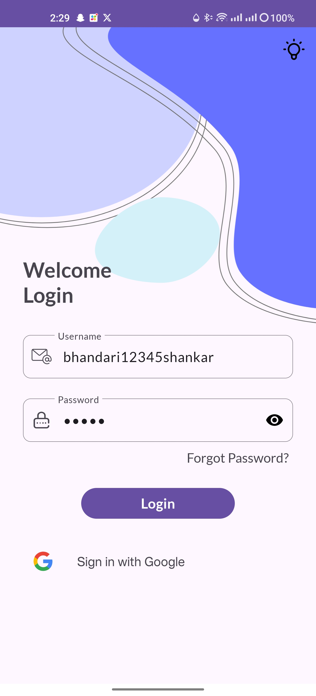

# Project Management Artifacts and Story Planning

---

## Project Overview:

The Android application aims to provide users with a convenient way to track their income and
expenses. It will implement profile management functionalities, user authentication with
multi-factor authentication mechanisms (MFAs), expense recording, categorization, and visualization
of spending patterns using graphs or charts. Additionally, the application will prioritize security
by implementing proper encryption measures.

## Development Approach:

The development will follow the MVVM (Model-View-ViewModel) architecture pattern as well as hilt to ensure
separation of concerns and maintainability. Tasks will be broken down into manageable components,
estimated for man-hours, and assigned story points for efficient project management. The Architecture image 
is presented below

 

---

## User Stories and Tasks:

### 1. Profile Management and User Authentication:

- **User Story:**
  As a user, I want to be able to create and manage my profile securely.
- **Tasks:**
    - Implement user registration functionality.
    - Implement user login and logout functionality.
    - Integrate multi-factor authentication mechanisms with firebase for enhanced security.
    - Ensure proper encryption and storage of user credentials.

### 2. Expense Recording:

- **User Story:**
  As a user, I want to record my expenses easily and efficiently.
- **Tasks:**
    - Create UI for expense recording with input fields for amount, date, category, and notes.
    - Implement data validation for input fields.
    - Implement logic to store recorded expenses securely.

### 3. Expense Categorization:

- **User Story:**
  As a user, I want to categorize my expenses to better understand my spending habits.
- **Tasks:**
    - Create predefined expense categories.
    - Implement the ability for users to customize categories.
    - Allow users to assign categories to recorded expenses.

### 4. Visualization of Spending Patterns:

- **User Story:**
  As a user, I want to visualize my spending patterns using graphs or charts.
- **Tasks:**
    - Integrate a charting library for displaying expense data.
    - Develop UI for displaying graphs or charts.
    - Implement logic to fetch and process expense data for visualization.

### 5. Security Measures:

- **User Story:**
  As a user, I want assurance that my sensitive information is encrypted and protected.
- **Tasks:**
    - Implement encryption mechanisms for sensitive data storage.
    - Ensure secure transmission of data over the network.
    - Implement authentication and authorization checks for accessing sensitive functionalities.

### 6. UI Design and Theme Customization:

- **User Story:**
  As a user, I want a visually appealing and customizable user interface.
- **Tasks:**
    - Design visually appealing UI screens for all functionalities.
    - Implement theme customization options for users to personalize their experience.

### 7. Optional Features:

- **User Story:**
  As a user, I want personalized recommendations or additional features to enhance my experience.
- **Tasks:**
    - Brainstorm and propose additional features or enhancements.
    - Implement selected optional features based on priority and feasibility.

---

## Time Estimation:

- **Total Estimated Man-Hours:** 125 hours

### Story Points:

- **Total Story Points:** 31 SP

---

## Project Flow:

1. **Setup and Environment Configuration:** 5 SP
2. **User Authentication and Profile Management:** 8 SP
3. **Expense Recording and Categorization:** 8 SP
4. **Visualization and Chart Integration:** 8 SP
5. **Security Implementation:** 5 SP
6. **UI Design and Theme Customization:** 10 SP
7. **Testing and Bug Fixes:** 8 SP

---

*Note: Story points and time estimations are approximate and subject to change based on project
requirements.*

---

## Repository Structure:

- `docs/`: Contains project management artifacts and documentation.
- `app/`: Android application source code.
- `README.md`: Project overview and setup instructions.
- `LICENSE`: License information for the project.

---

This comprehensive plan outlines the project's objectives, tasks breakdown, time estimations, and
story points allocation, providing a structured approach for efficient development and management of
the Android application.

--- 

## Images of The App

    
    
    
    
    
    
    
    
    
    
    
    
    
    
    

